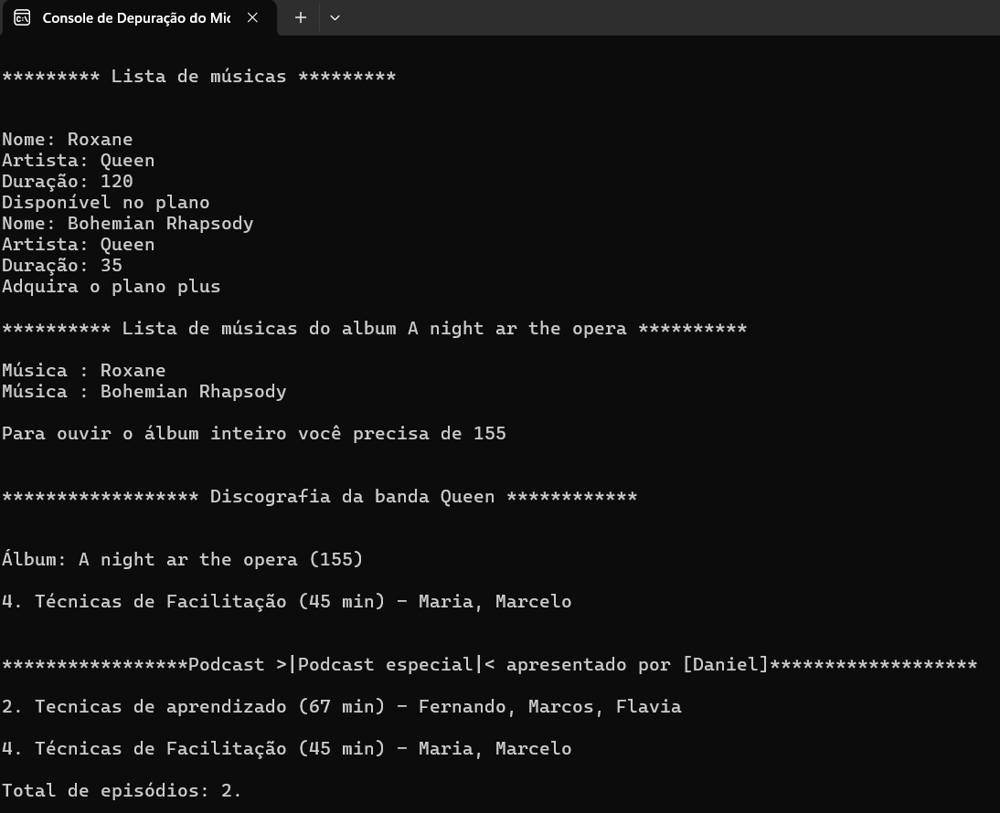

<p align="center">
  <a href="#about">Sobre</a>&nbsp;&nbsp;&nbsp;|&nbsp;&nbsp;&nbsp;  
  <a href="#technologies">Tecnologias usadas</a>&nbsp;&nbsp;&nbsp;|&nbsp;
  <a href="#preview">Prévia</a>&nbsp;&nbsp;&nbsp;|&nbsp;&nbsp;&nbsp;
  <a href="#rodar">Como rodar os testes</a>&nbsp;&nbsp;&nbsp;|&nbsp;&nbsp;&nbsp;
  <a href="#license">Licença</a>
</p>

<p align="center">
  

  

  
</p>

<a id="about"></a>

## :books: Sobre

O Screen Sound é uma aplicação que permite:

- Cadastrar música
- Listar músicas
- Criar álbum
- Visualizar músicas de um álbum
- Exibe discografia da banda
- Lista de podcast

Onde foi trabalhado conceitos de orientação a objetos: construtores, classes, propriedades, métodos, listas e lambdas.

<a id="technologies"></a><br>

## ⚒️ Tecnologias usadas

- C#

<a id="preview"></a><br>

## :tv: Prévia



<a id="rodar"></a><br>

## 🚀 Como rodar os testes

- Clonar este repositório

```
git clone https://github.com/RuthMaria/ScreenSound.git
```

- Rodar o projeto no Visual Studio

<a id="license"></a><br>

## :memo: Licença

Este projeto está sob licença do MIT. Consulte o arquivo [LICENSE](LICENSE.md) para obter mais detalhes.

---

<h4 align="center">
    Desenvolvido com ❤️ por <a href="https://www.linkedin.com/in/ruth-maria-9b256071/" target="_blank">Ruth Maria</a>
</h4>
